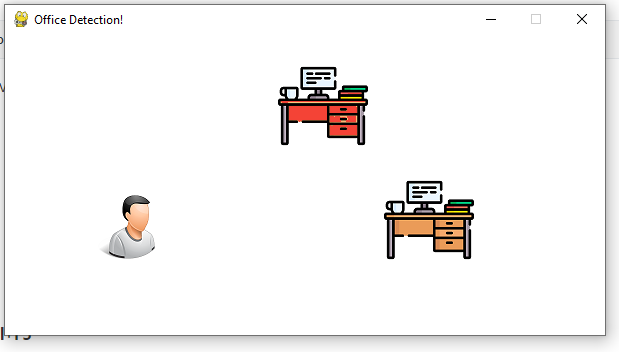
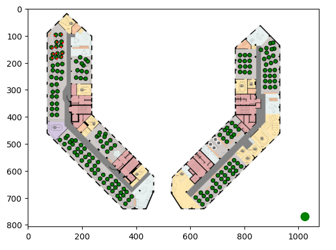
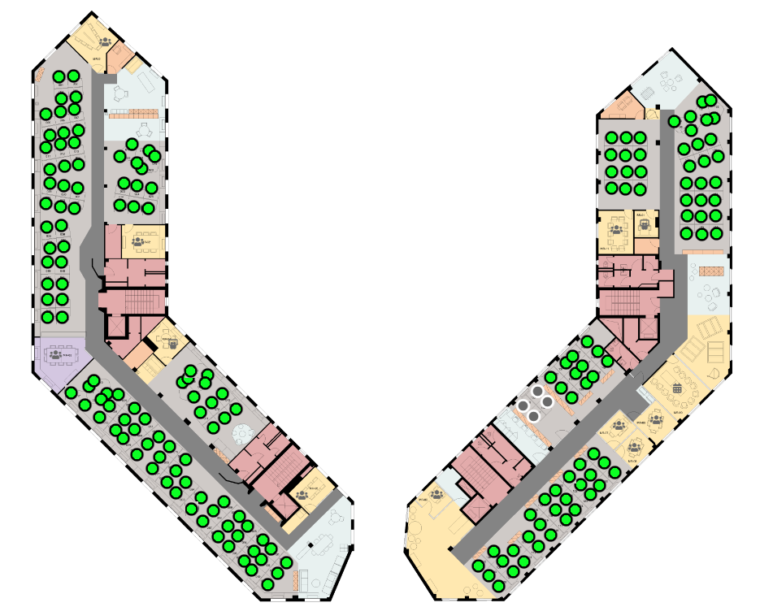
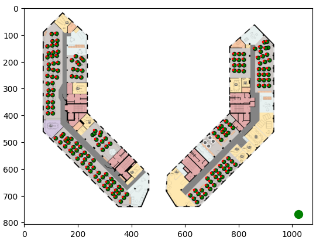
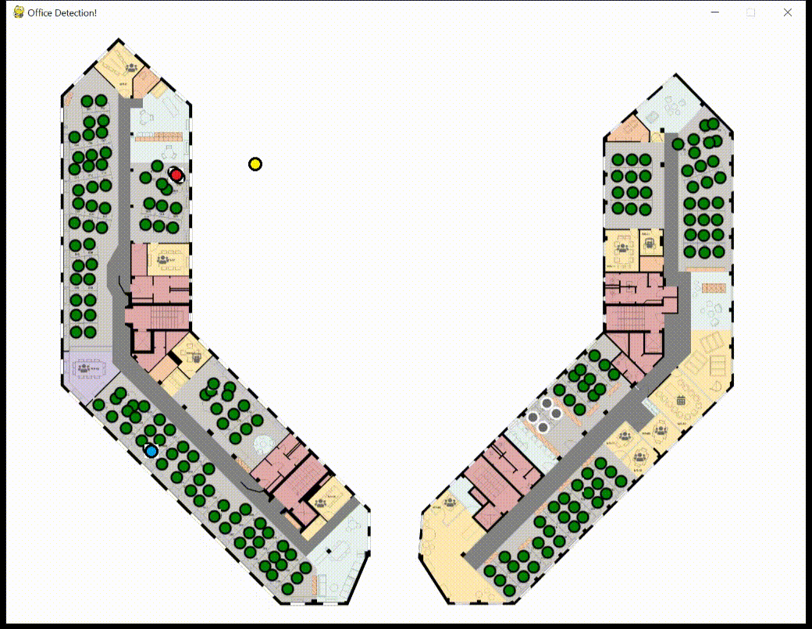
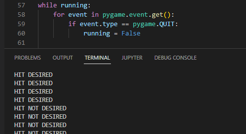

# How to create a custom Reinforcement Learning Environment in Gym


## Step 1. Creation of  Python environment

I will create an environment called **gym**, because we are interested in the **Gymnasium** library.

Gymnasium is **an open source Python library for developing and comparing reinforcement learning algorithms** by providing a standard API to communicate between learning algorithms and environments, as well as a standard set of environments compliant with that API. 

First you need to install anaconda at this [link](https://www.anaconda.com/products/individual)

then after is installed type in your terminal

```
conda create -n gym python==3.7
```

then

```
conda activate gym
```

then we install the following libraries

```
pip install   gym==0.18.0 keras notebook  pygame matplotlib tensorflow  keras-rl2
```

hen in your terminal type the following commands:

```
conda install ipykernel
```

then we install

```
python -m ipykernel install --user --name gym --display-name "Python (Gym)"
```

and then  we clone our repository

```
git clone https://github.com/ruslanmv/How-to-create-custom-Reinforcement-Learning-environment.git
```


```
cd How-to-create-custom-Reinforcement-Learning-environment
```

```
pip install -e snake
```


then we type

```
jupyter notebook
```


and we choose our Python (Gym) notebook


If you want to uninstall your environment

```
conda env remove -n gym
```

and by typing

```
jupyter kernelspec list
```

 to get the paths of all your kernels.
Then simply uninstall your unwanted-kernel

```
jupyter kernelspec uninstall gym
```


# Creating an Open AI Gym Environment

Once is loaded the Python (Gym) kernel  you can open the example notebooks.

The first notebook, is simple the game  where we want to develop the appropriate environment

 [0-Custom-Snake-Game.ipynb](https://github.com/ruslanmv/How-to-create-custom-Reinforcement-Learning-environment/blob/master/0-Custom-Snake-Game.ipynb)


The second notebook is an example about how to initialize the **custom environment,**

[snake_env.py](https://github.com/ruslanmv/How-to-create-custom-Reinforcement-Learning-environment/blob/master/snake/snake/envs/snake_env.py)

where it  has the structure


in our case 


[1-Creating-a-Gym-Environment.ipynb](https://github.com/ruslanmv/How-to-create-custom-Reinforcement-Learning-environment/blob/master/1-Creating-a-Gym-Environment.ipynb)

and finally the third notebook is simply an application of the Gym Environment into a RL model.

[2-Applying-a-Custom-Environment.ipyn](https://github.com/ruslanmv/How-to-create-custom-Reinforcement-Learning-environment/blob/master/2-Applying-a-Custom-Environment.ipynb)


# Custom office game


We are interested to build  a program that will find the best desktop .

The first program is the game where will be developed the environment of gym.

[12_many_office_detection.py](https://github.com/ruslanmv/How-to-create-custom-Reinforcement-Learning-environment/blob/master/custom_game/basics_py/12_many_office_detection.py)


After is cloned this repo , open with  in **Visual Studio Code**

```
code .
```

you can open the program

```
How-to-create-custom-Reinforcement-Learning-environment\custom_game\12_many_office_detection.py
```

make sure you have the **Gym** environment


run this program by pressing **ctrl+F5** 



and move with the arrows the desired desktop.


## Manual Generator of coordinates

On Python >= 3.6, you can also try this command:

```
pip install pyqt5
```

Let us assume that we want to get the coordinates of seats of one building. There are several places marked with green points.

We can determine the coordinates with the following program

[Tool-Pixel-1.ipynb](https://github.com/ruslanmv/How-to-create-custom-Reinforcement-Learning-environment/blob/master/custom_game/Tool-Pixel-1.ipynb)

we can get the list of coordinates of seats of the map.



## Automatic Generator of coordinates

Let us assume that you have a different setup of seats, so in order to identify the green circles we can use open cv

```
pip install opencv-python
```

In this program [Tool-pixel-3.ipynb](https://github.com/ruslanmv/How-to-create-custom-Reinforcement-Learning-environment/blob/master/custom_game/Tool-pixel-3.ipynb)

we can find the all the seats



Then we find all the centers of those contours



That will be the positions of our game

and can be loaded by  the command

```python
import pickle
with open('seats.pkl', 'rb') as f:
    mynewlist = pickle.load(f)
```

# Office Seat Game

The following code, gives the game to select the seat. The person is the yellow circle.

The red circles, the desired, and the blue ones, the not desired.

[14_seat_office.py](https://github.com/ruslanmv/How-to-create-custom-Reinforcement-Learning-environment/blob/master/custom_game/basics_py/14_seat_office.py)




Each time you arrive to the red circles you got the **hit desired** goal otherwise is  **hit not desired**:



The next step is create the gym environment by using this game.


# Custom Environment Creation

Once the custom environment were created 

```
pip install -e worker
```


```
C:.
├───gymworker.egg-info
└───worker
    └───envs
```

